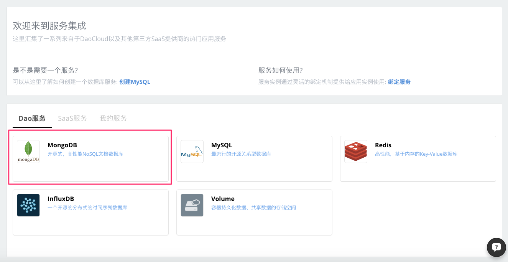
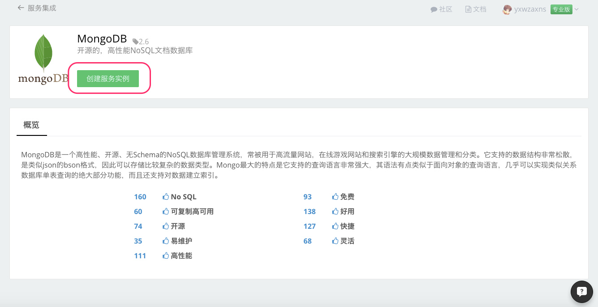
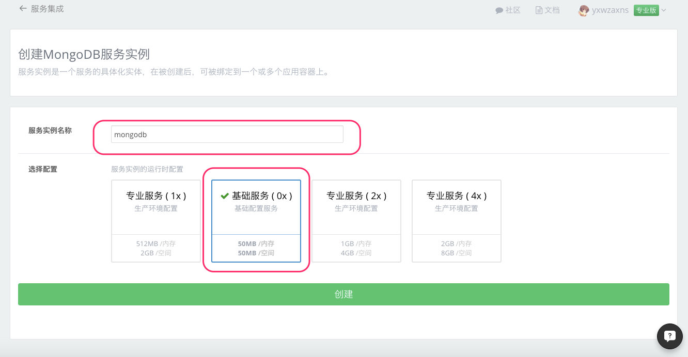
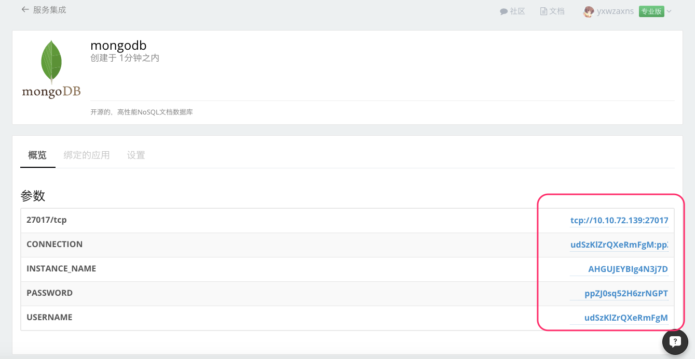
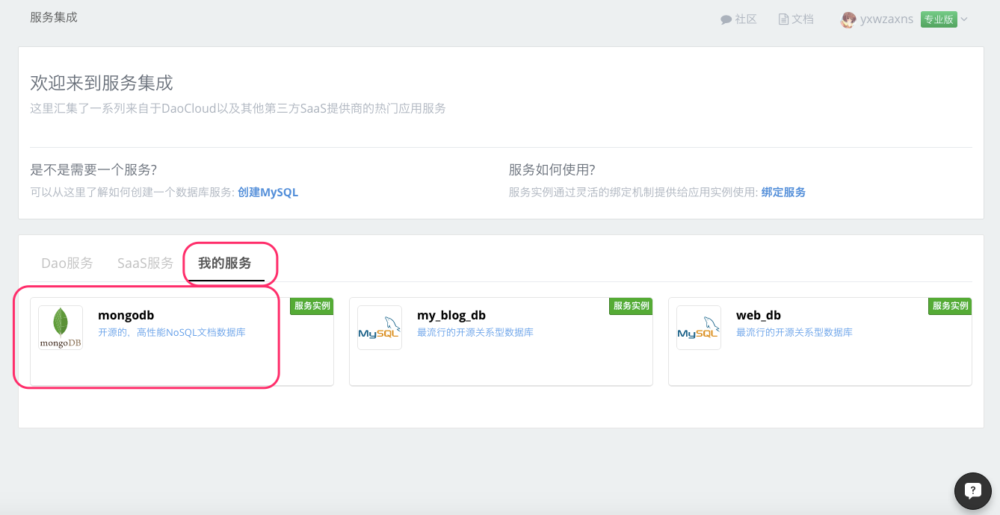
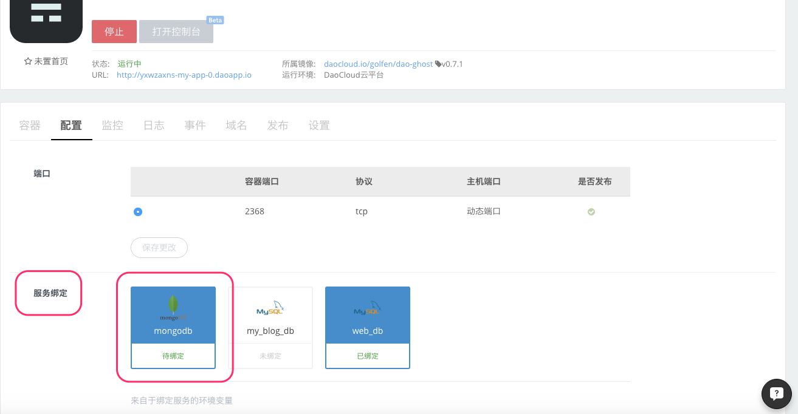
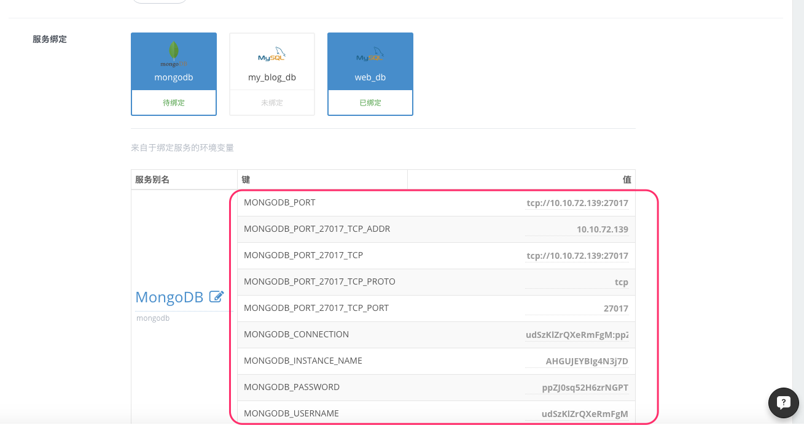
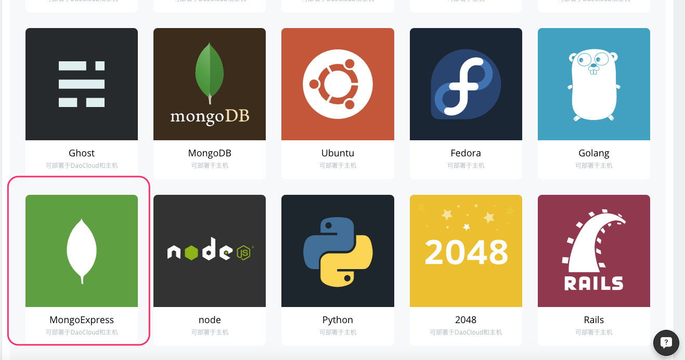
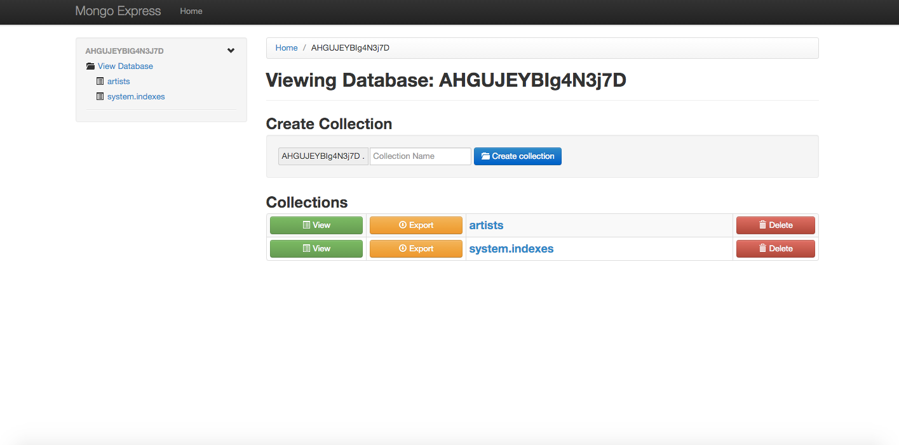

## 什么是 MongoDB

##### MongoDB是一个高性能、开源、无Schema的NoSQL数据库管理系统，常被用于高流量网站，在线游戏网站和搜索引擎的大规模数据管理和分类。它支持的数据结构非常松散，是类似json的bson格式，因此可以存储比较复杂的数据类型。Mongo最大的特点是它支持的查询语言非常强大，其语法有点类似于面向对象的查询语言，几乎可以实现类似关系数据库单表查询的绝大部分功能，而且还支持对数据建立索引。

## 在 DaoCloud 服务集成创建 MongoDB 服务。

  1. 登录 DaoCloud 控制台，选择「服务集成」。

  

  2. 在「Dao服务」里选择 MongoDB 服务。

  

  3. 点击 「创建服务实例」。

  

  4. 输入服务实例名称，选择合适的配置（注意：在配置里 DaoCloud 提供了【基础服务】和【生产环境】两种类型的配置，您可以根据您的需求选择相应的配置类型），点击「创建」按钮

  

  5. 创建完成，可以看到 MongoDB 服务的相关参数。

  

  6. 查看我已创建的服务

  

## MongoDB 与我的应用绑定

  1. 选择需要绑定 MongoDB 服务的应用，在「应用配置」下的「服务绑定」里选择刚刚创建好的 MongoDB 服务。

  

  2. 当您选择了要绑定的 MongoDB 服务以后，会发现下面出现了关于连接 MongoDB 所需要的信息，在您选择保存更改以后，这些信息会写入到您绑定应用的环境变量里，这样您就可以在代码里通过读取相关环境变量来使用 MongoDB 服务。(您可以在创建应用时绑定 MongoDB 服务，也可以把 MongoDB 服务绑定在现有的应用上)。

  

  2. 如何读取环境变量，下面我们展示一段使用 Ruby 语言来读写 MongoDB 的具体代码（完整的 Docker 镜像请前往 [GitHub](https://github.com/yxwzaxns/DaoCloud_MongoDB.git) ，您可以 fork 到自己的项目里运行这个例子）

          require 'sinatra'
          require 'mongo'

          module Sinatra
            class Base
              set :server, %w[thin mongrel webrick]
              set :bind, '0.0.0.0'
              set :port, 8080
            end
          end

          host = ENV['MONGODB_PORT_27017_TCP_ADDR'] || 'localhost'
          port = ENV['MONGODB_PORT_27017_TCP_PORT'] || 27017
          database = ENV['MONGODB_INSTANCE_NAME'] || 'demo'
          username = ENV['MONGODB_USERNAME'] || 'aong'
          password = ENV['MONGODB_PASSWORD'] || '1234'

          hostport=host+':'+port.to_s

          $db = Mongo::Client.new([hostport],
                                  :database => database,
                                  :user => username,
                                  :password => password)

          get '/' do
            body "welcome,this is a info about MongoDB:
            host:#{ENV['MONGODB_PORT_27017_TCP_ADDR']}
            username:#{ENV['MONGODB_USERNAME']}
            password:#{ENV['MONGODB_PASSWORD']}
            port:#{ENV['MONGODB_PORT_27017_TCP_PORT']}
            database:#{ENV['MONGODB_INSTANCE_NAME']}"

          end

          get '/get/:name' do
            res = $db[:artists].insert_one({ name: params['name'] })
            redirect to('/get')
          end

          get '/get' do
            result = $db[:artists].find()
            s=[]
            result.each do |a|
              s.push a['name']
            end
            body "#{s}"
          end

    成功部署后访问应用，便可以看到连接 MongoDB 所需要的相关信息已经被成功读取出来,并且您可以参考上面的代码往 MongoDB 里写入数据，例如：
    http://your_app_url_path/get/name

    

## 管理 MongoDB 服务
 1. Mongo Express 是使用 Node.js 和 Express 框架实现的轻量级 MongoDB 数据库管理程序，通过它您可以轻松管理您的 MongoDB 数据库。
 这里我们使用 DaoCloud 提供的 Mongo Express 镜像来创建一个 Mongo Express 应用，用它来管理我们的 MongoDB 服务。
  + 进入 DaoCloud 镜像仓库，选择 「DaoCloud镜像」下的 Mongo Express 镜像，点击「部署最新版本」。

  

  + 输入应用名称，选择运行环境，点击「基础设置」，进入下一步。

  + 绑定要使用的 MongoDB 服务，点击「立即部署」，应用启动成功后就可以进入 Mongo Express 执行常规的 MongoDB 服务管理操作了。（注意：目前在 DaoCloud 镜像仓库提供的 Mongo Express 版本不支持授权认证，您启动 Mongo Express 容器后，容器的 URL 是公开访问的。所以在您使用完毕后请立即「停止」容器，防止 MongoDB 数据库被他人操作。）

  
