## 什么是 MySQL

##### MySQL 是一种开放源代码的关系型数据库管理系统（RDBMS），MySQL 数据库系统使用最常用的数据库管理语言--结构化查询语言（SQL）进行数据库管理。 MySQL由于其性能高、成本低、可靠性好，已经成为最流行的开源数据库，被广泛地应用在 Internet 上的中小型网站中。随着 MySQL 的不断成熟，它也逐渐用于更多大规模网站和应用，比如维基百科、Google 和 Facebook 等网站。非常流行的开源软件组合 LAMP 中的“M”指的就是 MySQL。

## 在 DaoCloud 服务集成创建 MySQL 服务。

  1. 登录 DaoCloud 控制台，选择「服务集成」。

  

  2. 在「Dao服务」里选择 MySQL 服务。

  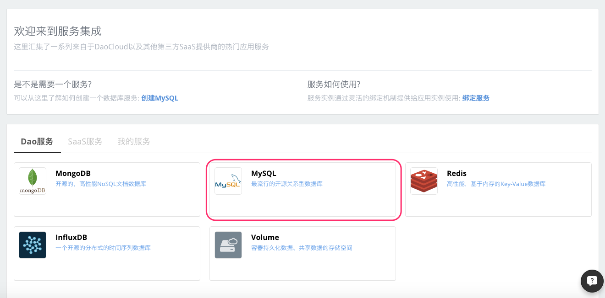

  3. 点击 「创建服务实例」。

  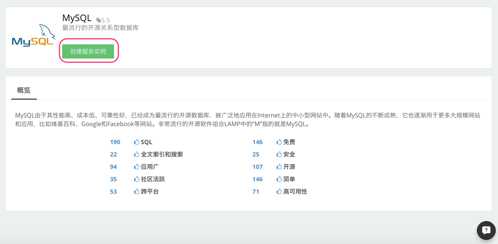

  4. 输入服务实例名称，选择合适的配置（注意：在配置里 DaoCloud 提供了【基础服务】和【生产环境】两种类型的配置，您可以根据您的需求选择相应的配置类型），点击「创建」按钮创建 MySQL 服务实例

  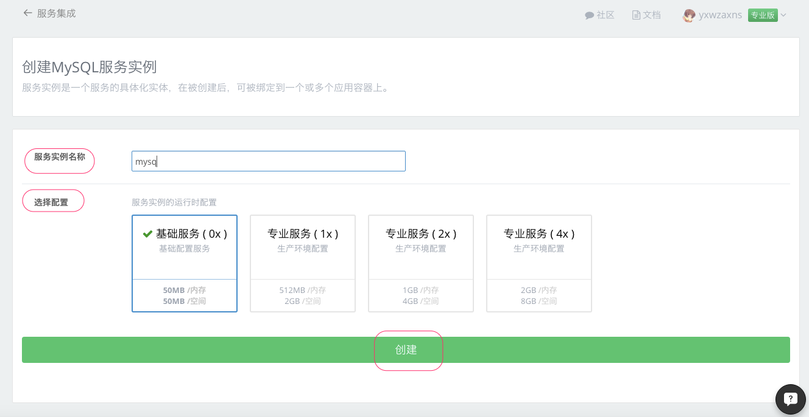

  5. 创建完成，可以看到 MySQL 服务的相关参数。

  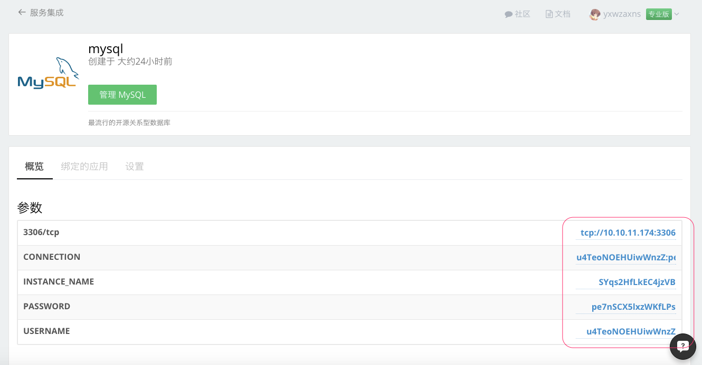

  6. 在「我的服务」里查看已创建的 MySQL 服务

  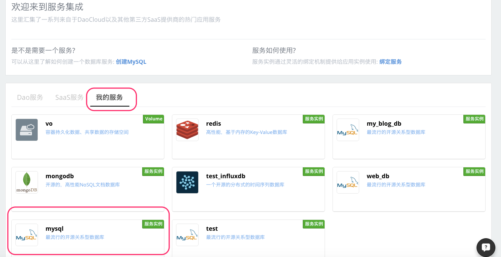

## MySQL 与我的应用绑定

  1. 选择需要绑定 MySQL 服务的应用，在「应用配置」下的「服务绑定」里选择
  刚刚创建好的 MySQL 服务。(您可以在创建应用时绑定 MySQL 服务，也可以把 MySQL 服务绑定在现有的应用上)。

  

  2. 当您选择了要绑定的 MySQL 服务以后，会发现下面出现了关于连接 MySQL 所需要的信息，在您选择保存更改以后，这些信息会写入到您绑定应用的环境变量里，这样您就可以在代码里通过读取相关环境变量来使用 MySQL 服务。

  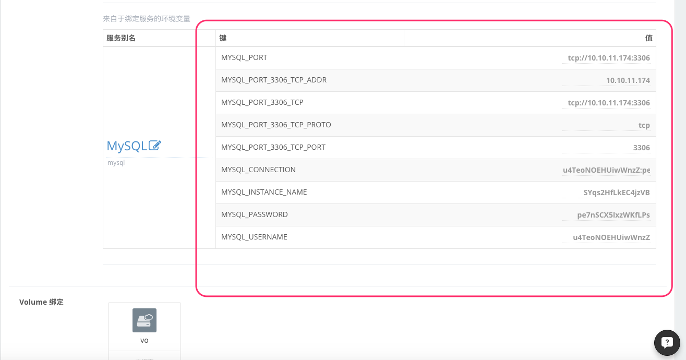

  2. 如何读取环境变量，下面我们使用 Ruby 语言来展示如何从环境变量里读取连接 MySQL 所需要的信息以及如何连接和操作 MySQL ，具体代码（完整的 Docker 镜像请前往 [GitHub](https://github.com/yxwzaxns/DaoCloud_MySQL.git) ，您可以 fork 到自己的项目里运行这个例子）

          require 'sinatra'
          require 'mysql2'

          module Sinatra
            class Base
              set :server, %w[thin mongrel webrick]
              set :bind, '0.0.0.0'
              set :port, 8080
            end
          end

          get '/' do
            body "welcome,this is a info about MySQL:
            host:#{ENV['MYSQL_PORT_3306_TCP_ADDR']}
            username:#{ENV['MYSQL_USERNAME']}
            password:#{ENV['MYSQL_PASSWORD']}
            port:#{ENV['MYSQL_PORT_3306_TCP_PORT']}
            database:#{ENV['MYSQL_INSTANCE_NAME']}"

          end

          get '/get/:score' do
            $storage.populate(params['score'])
          end

          get '/get' do
            "the score is: %d" % $storage.score
          end
          class Storage
            def initialize()
              @db = Mysql2::Client.new(
                :host => ENV['MYSQL_PORT_3306_TCP_ADDR'],
                :username => ENV['MYSQL_USERNAME'],
                :password => ENV['MYSQL_PASSWORD'],
                :port => ENV['MYSQL_PORT_3306_TCP_PORT'],
                :database => ENV['MYSQL_INSTANCE_NAME']
              )
              @db.query("CREATE TABLE IF NOT EXISTS scores(score INT)")
            end

            def populate(score)
              @db.query("INSERT INTO scores(score) VALUES(#{score})")
            end

            def score
              @db.query("SELECT * FROM scores").first['score']
            end
          end

          $storage = Storage.new

        成功部署后访问应用，便可以看到连接 MySQL 所需要的相关信息已经被成功读取出来。

        

## 管理 MySQL 服务
  1. 现在关于 MySQL 服务的管理工具有很多，DaoCloud 本身在 MySQL 服务里就集成了著名的 phpMyAdmin 管理工具。

    + 点击「服务集成」->「我的服务」选择对应的 MySQL 服务。

      

    + 在 MySQL 服务控制台，点击「管理 MySQL」按钮就可以进入 phpMyAdmin 管理界面。在这里您就可以执行常规的 MySQL 服务管理操作了。

      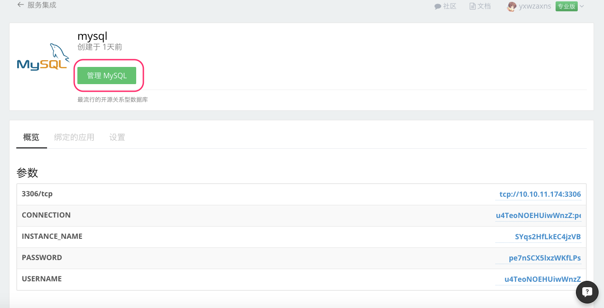

      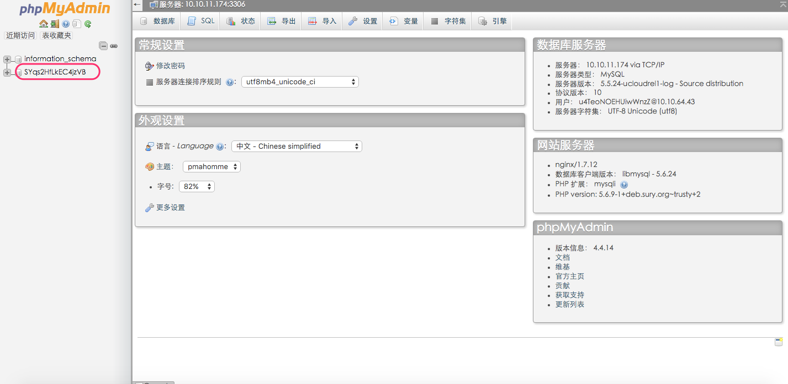

  2. 您也可以用 DaoCloud 官方提供的 phpMyAdmin 镜像来创建自己的 MySQL 管理工具。

    + 进入 DaoCloud 镜像仓库，选择 「DaoCloud镜像」下的 phpMyAdmin 镜像，点击「部署最新版本」。

      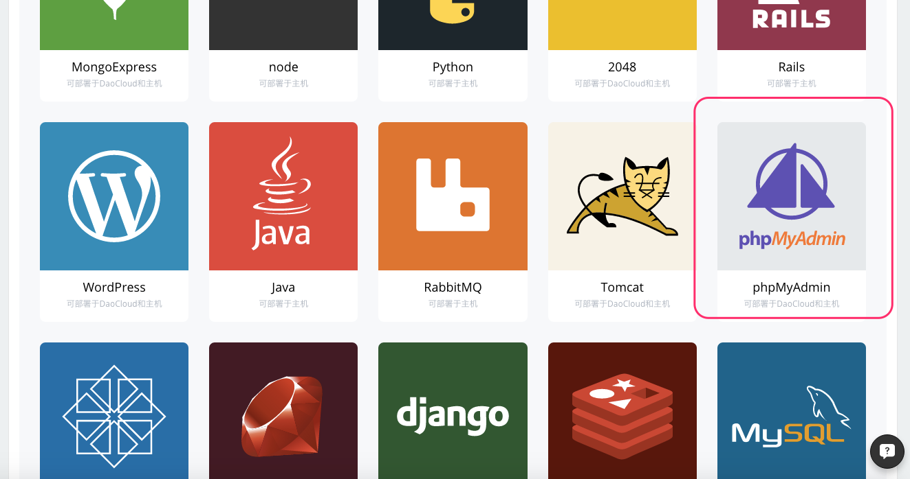
      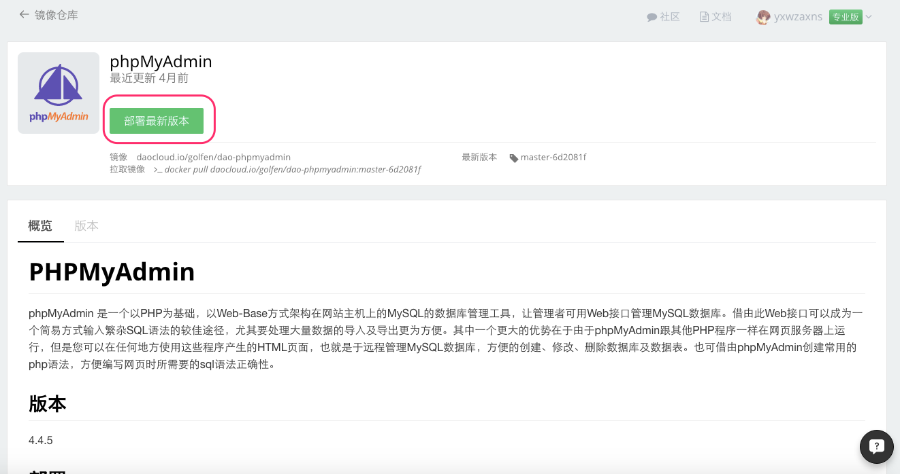

    + 输入应用名称，选择运行环境，点击「基础设置」，进入下一步。

    + 选择绑定要使用的 MySQL 服务，点击「立即部署」，应用启动成功后点击应用 URL，输入用户名和密码就可以进入 phpMyAdmin 执行常规的 MySQL 服务管理操作了。

      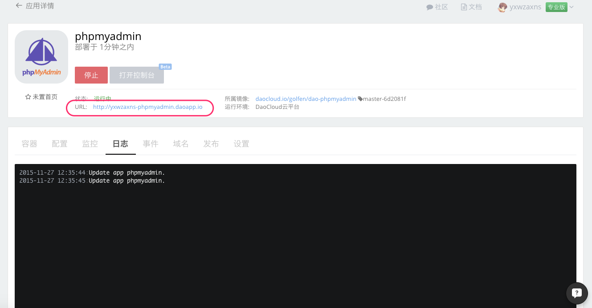

      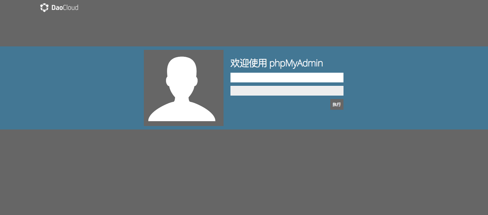

  #### 至此，我们已经掌握了如何创建和使用 DaoCloud 平台之上的 MySQL 服务。
