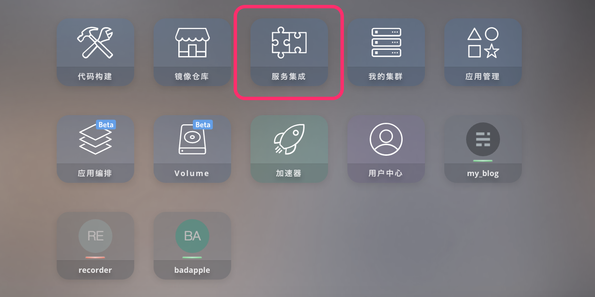
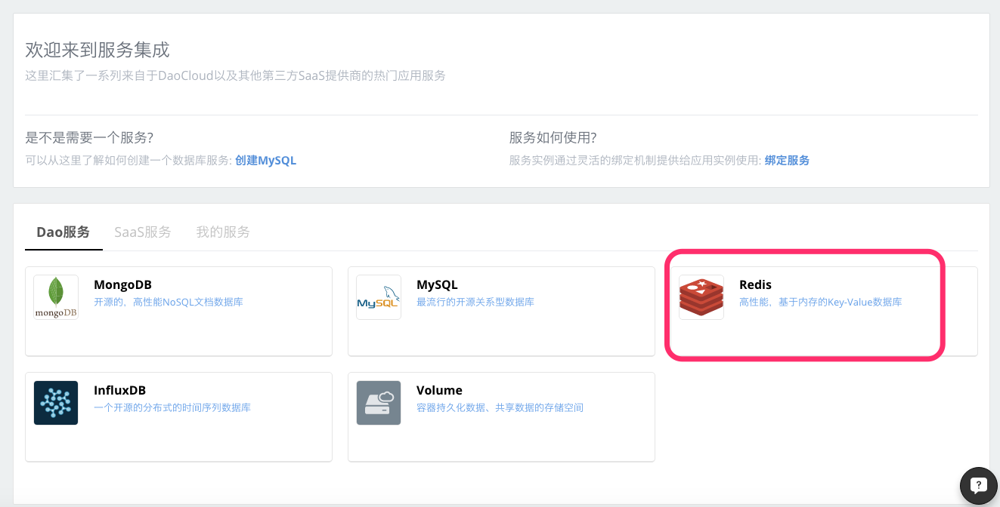
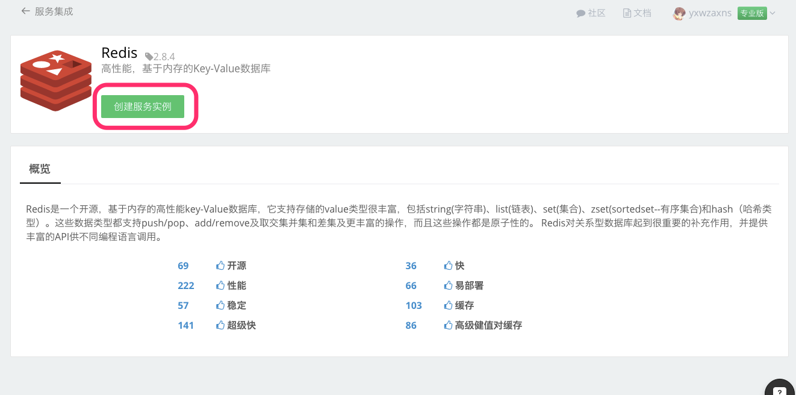
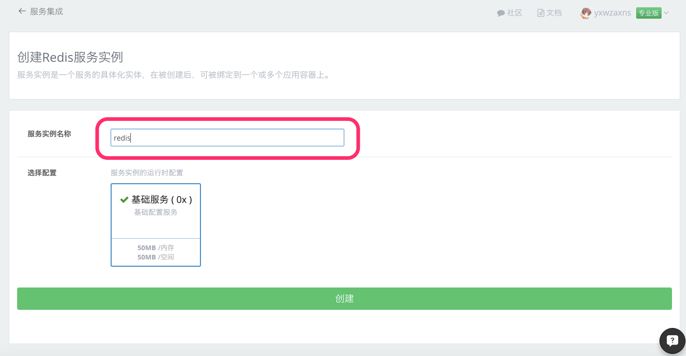
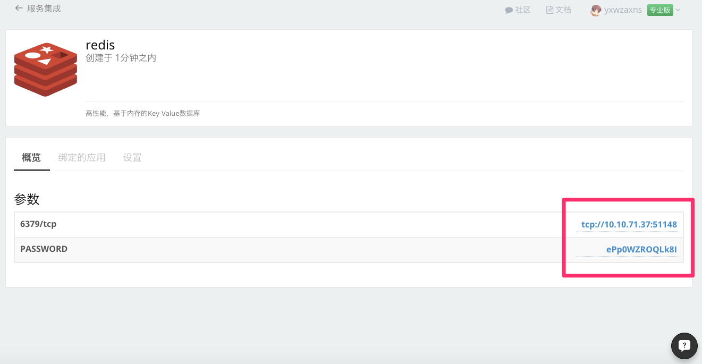
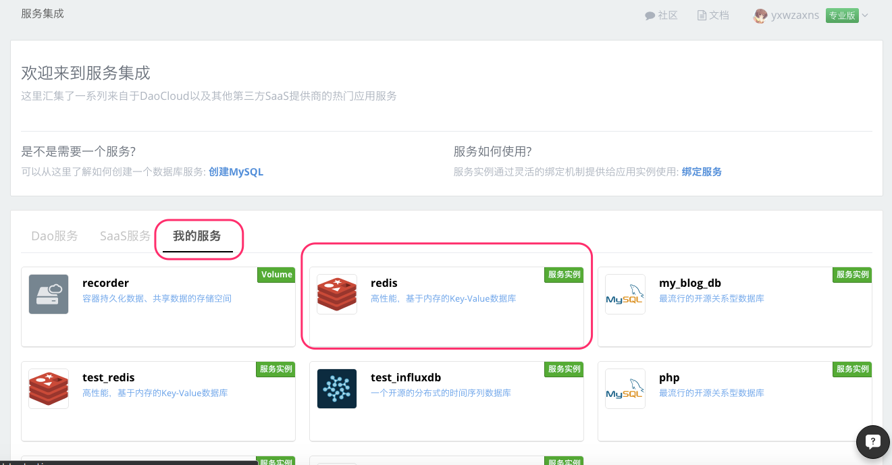
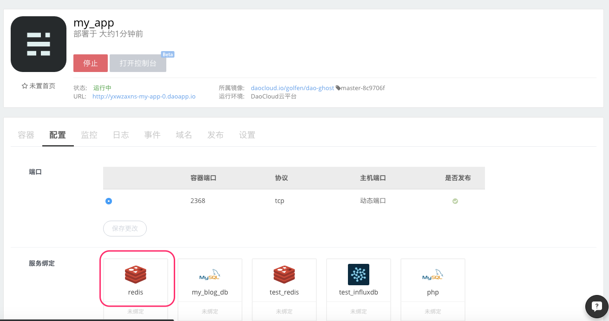
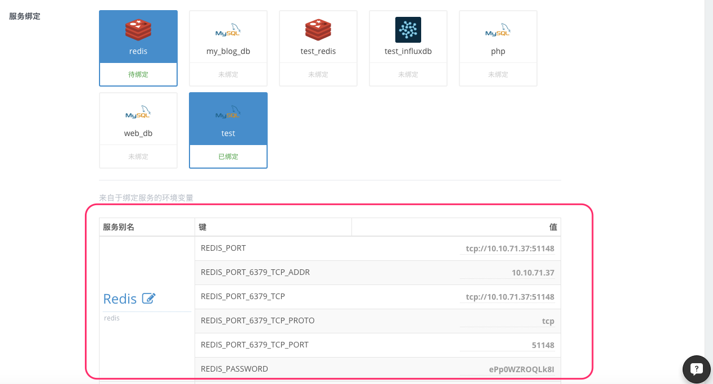
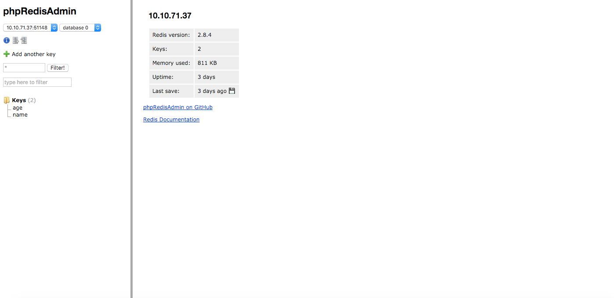

## 什么是 Redis

##### Redis是一个开源，基于内存的高性能key-Value数据库，它支持存储的value类型很丰富，包括string(字符串)、list(链表)、set(集合)、zset(sortedset--有序集合)和hash（哈希类型）。这些数据类型都支持push/pop、add/remove及取交集并集和差集及更丰富的操作，而且这些操作都是原子性的。Redis对关系型数据库起到很重要的补充作用，并提供丰富的API供不同编程语言调用

## 在 DaoCloud 服务集成创建 Redis 服务。

  1. 登录 DaoCloud 控制台，选择「服务集成」。

  

  2. 在「Dao服务」里选择 Redis 服务。

  

  3. 点击 「创建服务实例」。

  

  4. 输入服务实例名称，点击「创建」按钮

  

  5. 创建完成，可以看到 Redis 服务的相关参数。

  

  6. 查看我已创建的服务

  

## Redis 与我的应用绑定

  1. 选择需要绑定Redis服务的应用，在「应用配置」下的「服务绑定」里选择
  刚刚创建好的 Redis 服务。

  

  2. 当您选择了要绑定的 Redis 服务以后，会发现下面出现了关于连接 Redis 所需要的信息，在您选择保存更改以后，这些信息会写入到您绑定应用的环境变量里，这样您就可以在代码里通过读取相关环境变量来使用 Redis 服务。(您可以在创建应用时绑定 Redis 服务，也可以把 Reids 服务绑定在现有的应用上)。

  

  2. 如何读取环境变量，下面我们展示一段使用 Ruby 语言来读写 Redis 的具体代码（完整的 Docker 镜像请前往 [GitHub](https://github.com/yxwzaxns/DaoCloud_redis.git) ，您可以 fork 到自己的项目里运行这个例子）

          #myapp.rb
          require 'sinatra'
          require 'redis'

          module Sinatra
            class Base
              set :server, %w[thin mongrel webrick]
              set :bind, '0.0.0.0'
              set :port, 8080
            end
          end

          redis = Redis.new(:host => ENV['REDIS_PORT_6379_TCP_ADDR'],
                            :port => ENV['REDIS_PORT_6379_TCP_PORT'],
                            :password => ENV['REDIS_PASSWORD'])

          get '/' do
            host=ENV['REDIS_PORT_6379_TCP_ADDR']
            port=ENV['REDIS_PORT_6379_TCP_PORT']
            password=ENV['REDIS_PASSWORD']
            "Redis_info:\nhost is#{host}\nport is:#{port}\npassword is:#{password}"
          end

          get '/set/*/*' do
            redis.set(params['splat'][0],params['splat'][1])
          end

          get '/get/:name' do
            redis.get(params['name'])
          end

    成功部署后访问应用，便可以看到连接 Redis 所需要的相关信息已经被成功读取出来

## 管理 Redis 服务
 1. 管理我的 Redis 服务

      在 GitHub 上有许多 Redis 服务管理工具，比如 [phpRedisAdmin](https://github.com/erikdubbelboer/phpRedisAdmin.git)，这里我们把 phpRedisAdmin 构建成 Docker 镜像来管理我们的 Redis 服务。

      GitHub 地址：[https://github.com/yxwzaxns/DaoCloud_phpRedisAdmin.git](https://github.com/yxwzaxns/DaoCloud_phpRedisAdmin.git)

 2. 部署管理工具，绑定之前创建的 Redis 服务，应用启动成功后就可以执行常规的 Redis 服务管理操作

 
